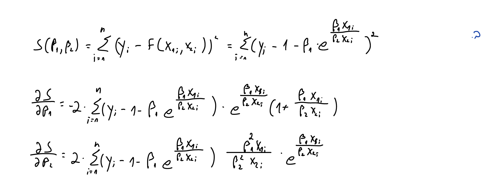
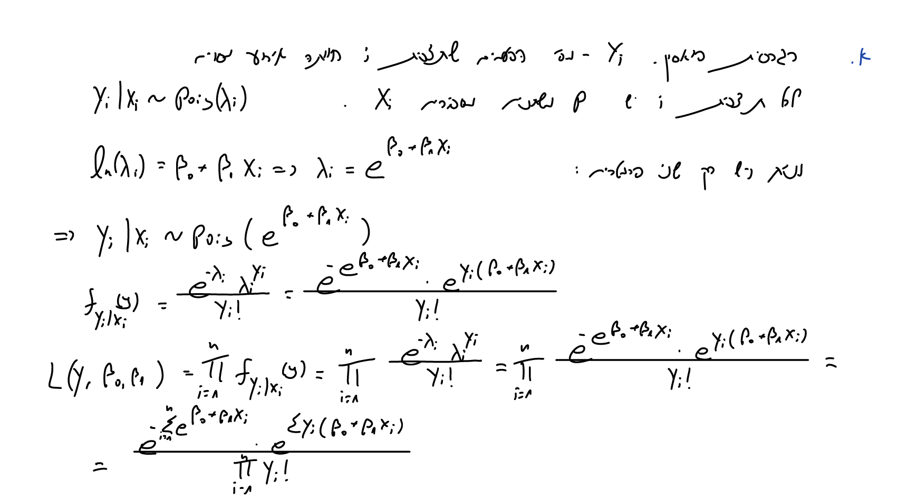
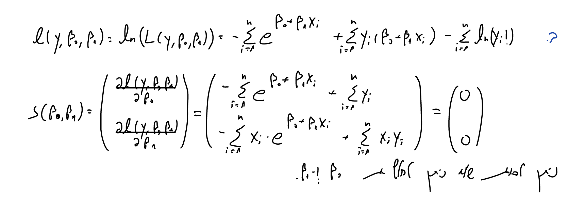
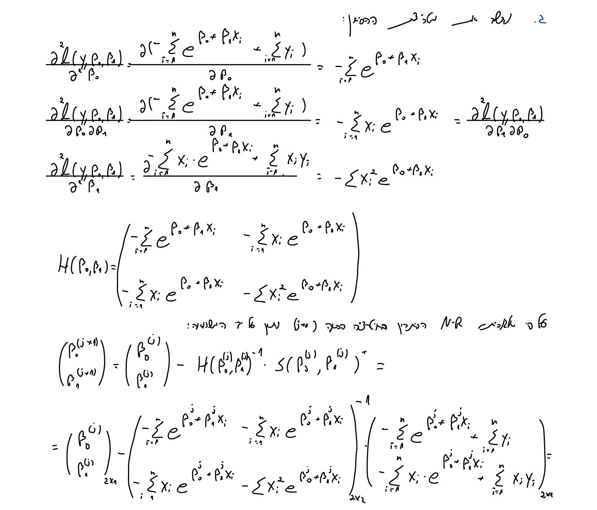
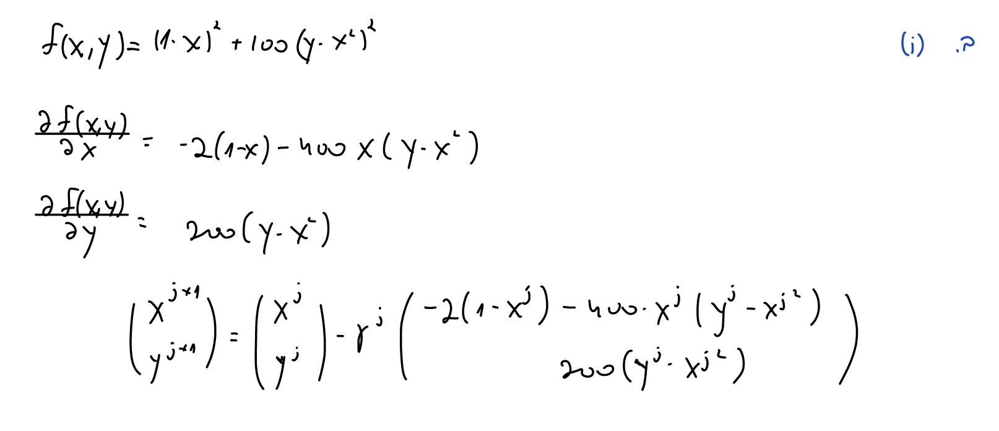
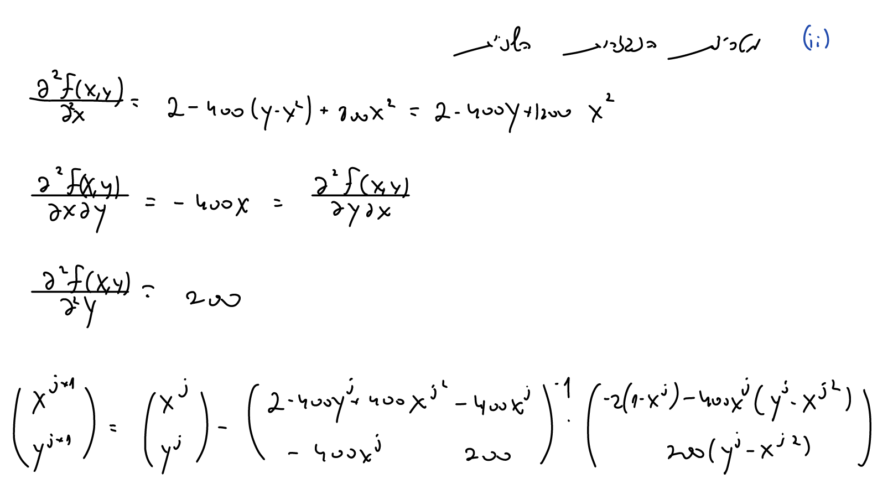

# Q1 #

## a ##

```{r,echo=FALSE}
knitr::include_graphics("1.a.png")
```


```{r}
# ex6data1 <- read.csv("C:/Users/Alon/Desktop/Studies/Statistics/Statistical_Computing/Exercises/HW6/ex6data1.csv")

ex6data1 <- read.csv("~/Desktop/Ran/D year/semester b/hishov statisti/exercies/HW6/ex6data1.csv")

graduent.func <- function(beta1,beta2,x1_vec,x2_vec){
  ### input: beta1,beta2. output: the derivative for beta0 and beta1
  beta1_derivative <- ( 1 + (beta1*x1_vec)/(beta2*x2_vec) ) * exp((beta1*x1_vec)/(beta2*x2_vec))
  beta2_derivative <- - ( (beta1*beta1*x1_vec)/(beta2*beta2*x2_vec) ) * exp((beta1*x1_vec)/(beta2*x2_vec))
  return(matrix(data = c(beta1_derivative,beta2_derivative),ncol = 2))
}

beta1.j <- beta2.j <- 1 # first guess
y_vec.Q1 <- ex6data1$y
x1_vec.Q1 <- ex6data1$x1
x2_vec.Q1 <- ex6data1$x2

eps_for_break <- 10^-7

while (TRUE) {
  errors.j <- y_vec.Q1 - 1 - beta1.j*exp((beta1.j*x1_vec.Q1)/(beta2.j*x2_vec.Q1))
  betas.j <- matrix(data = c(beta1.j,beta2.j),nrow = 2,ncol = 1)
  W.j <- graduent.func(beta1.j,beta2.j,x1_vec.Q1,x2_vec.Q1)
  betas.j_1 <- betas.j + ( solve(t(W.j)%*%W.j) %*% t(W.j) ) %*% errors.j
  beta1.j <- betas.j_1[1]
  beta2.j <- betas.j_1[2]
  if (max(abs(betas.j_1 - betas.j)) < eps_for_break) {break}
}


```


```{r,echo=FALSE}
cat(sprintf("beta1 (GN) = %s", round(beta1.j,3)),
    sprintf("beta2 (GN) = %s", round(beta2.j,3)),
    sep = "\n")

```

## b ##

```{r,echo=FALSE}

```

```{r}
delta <- 10^-4

grad_s <- function(beta1,beta2,x1_vec,x2_vec,y_vec){
  d_s_d_beta1 <- - 2 * sum( ( y_vec - 1 - beta1*exp((beta1*x1_vec)/(beta2*x2_vec)) ) * exp((beta1*x1_vec)/(beta2*x2_vec)) * (1+(beta1*x1_vec)/(beta2*x2_vec)))
  
  d_s_d_beta2 <- 2 * sum( ( y_vec - 1 - beta1*exp((beta1*x1_vec)/(beta2*x2_vec)) ) * exp((beta1*x1_vec)/(beta2*x2_vec)) * (beta1*beta1*x1_vec)/(beta2*beta2*x2_vec))
  
    return(matrix(data = c(d_s_d_beta1,d_s_d_beta2),nrow = 1,ncol = 2))
}

hesian.Q1 <- function(beta1,beta2,x1_vec,x2_vec,y_vec,delta){
  y_d2_beta1 <- grad_s(beta1+delta,beta2,x1_vec,x2_vec,y_vec) - grad_s(beta1-delta,beta2,x1_vec,x2_vec,y_vec)
  
  y_d2_beta1 <- y_d2_beta1[1] / (2*delta)
  
  y_d2_beta2 <- grad_s(beta1,beta2+delta,x1_vec,x2_vec,y_vec) - grad_s(beta1,beta2-delta,x1_vec,x2_vec,y_vec)
  
  y_d2_beta2 <- y_d2_beta2[2] / (2*delta)
  
  y_d_beta1_d_beta2 <- grad_s(beta1,beta2+delta,x1_vec,x2_vec,y_vec) - grad_s(beta1,beta2-delta,x1_vec,x2_vec,y_vec)
  
  y_d_beta1_d_beta2 <- y_d_beta1_d_beta2[1] / (2*delta)
  
  return(matrix(data = c(y_d2_beta1,y_d_beta1_d_beta2,y_d_beta1_d_beta2,y_d2_beta2),nrow = 2,ncol = 2))
  
  }

beta1_h.j <- beta2_h.j <- 1 # first guess
y_vec.Q1 <- ex6data1$y
x1_vec.Q1 <- ex6data1$x1
x2_vec.Q1 <- ex6data1$x2

counter <- 0

eps_for_break <- 10^-5

while (TRUE) {
  counter <- counter+1
  betas_h.j <- matrix(c(beta1_h.j,beta2_h.j),ncol = 1)
  betas_h.j_1 <- betas_h.j - solve(hesian.Q1(beta1_h.j,beta2_h.j,x1_vec.Q1,x2_vec.Q1,y_vec.Q1,delta)) %*% t(grad_s(beta1_h.j,beta2_h.j,x1_vec.Q1,x2_vec.Q1,y_vec.Q1))
  
  beta1_h.j <- betas_h.j_1[1]
  beta2_h.j <- betas_h.j_1[2]
  if (max(abs(betas_h.j_1 - betas_h.j)) < eps_for_break) {break}
}


```

```{r,echo=FALSE}
cat(sprintf("beta1 (NR) = %s", round(beta1_h.j,3)),
    sprintf("beta2 (NR) = %s", round(beta2_h.j,3)),
    sep = "\n")

```

We can see that the both methods give us same beta1 & beta2.


# Q2 #

## a ##

```{r,echo=FALSE}

```

## b ##

```{r,echo=FALSE}

```

## c + d ##

```{r,echo=FALSE}

```

```{r}
ex6_count_data <- read.csv("~/Desktop/Ran/D year/semester b/hishov statisti/exercies/HW6/count_data.csv")

y_vec.Q2 <- ex6_count_data$y
x_vec.Q2 <- ex6_count_data$x
```


```{r}
grad_s.Q2 <- function(beta0,beta1,x_vec,y_vec){
  
  d_log_like_d_beta0 <- - sum(exp(beta0 + beta1 * x_vec)) + sum(y_vec)
  
  d_log_like_d_beta1 <- - sum(x_vec * (exp(beta0 + beta1 * x_vec))) +
    sum(x_vec * y_vec)
  
  return(matrix(data = c(d_log_like_d_beta0,d_log_like_d_beta1),
                nrow = 2,ncol = 1))
  
}
```


```{r}
hesian.Q2 <- function(beta0,beta1,x_vec){
  
  s_d2_beta0 <- - sum(exp(beta0 + beta1 * x_vec))
  
  s_d_beta0_d_beta1 <- - sum(x_vec * (exp(beta0 + beta1 * x_vec)))
  
  s_d2_beta1 <- - sum(x_vec^2 * (exp(beta0 + beta1 * x_vec)))
  
  return(matrix(data = c(s_d2_beta0,s_d_beta0_d_beta1,s_d_beta0_d_beta1,s_d2_beta1),
                  nrow = 2,ncol = 2))
  
}
```

```{r}
beta0_h.j <- beta1_h.j <- 1 # first guess

eps_for_break <- 10^-5

while (TRUE) {

  betas_h.j <- matrix(c(beta0_h.j,beta1_h.j),ncol = 1)
  
  betas_h.j_1 <- betas_h.j - solve(hesian.Q2(beta0_h.j,beta1_h.j,x_vec.Q2)) %*%
    (grad_s.Q2(beta0_h.j,beta1_h.j,x_vec.Q2,y_vec.Q2))
  
  beta0_h.j <- betas_h.j_1[1]
  beta1_h.j <- betas_h.j_1[2]
  
  if (max(abs(betas_h.j_1 - betas_h.j)) < eps_for_break) {break}
}

```

```{r,echo=FALSE}
cat(sprintf("beta0 (NR) = %s", round(beta0_h.j,5)),
    sprintf("beta1 (NR) = %s", round(beta1_h.j,5)),
    sep = "\n")
```

```{r}
model <- glm(formula = y_vec.Q2~x_vec.Q2, family = "poisson")
betas_glm <- summary(model)
beta0_glm <-  betas_glm$coefficients[1]
beta1_glm <-  betas_glm$coefficients[2]
```

```{r,echo=FALSE}
cat(sprintf("beta0 (glm) = %s", round(beta0_glm,5)),
    sprintf("beta1 (glm) = %s", round(beta1_glm,5)),
    sep = "\n")
```

We can see that the both methods give us same beta0 & beta1.

```{r}
sd_beta0_glm <-  betas_glm$coefficients[3]
sd_beta1_glm <-  betas_glm$coefficients[4]
```


```{r,echo=FALSE}
cat(sprintf("beta0 sd (glm) = %s", round(sd_beta0_glm,5)),
    sprintf("beta1 sd (glm) = %s", round(sd_beta1_glm,5)),
    sep = "\n")
```


## e ##

The Information matrix (-E[Hesian]) is not a function of a random variable so NR algorithm and FS algorithm are same.


# Q5 #

## a ##

```{r,echo=FALSE}
#
knitr::include_graphics(c("5.a.1.png","5.a.2.png"))
```

## b ##

```{r}
ex6data2 <- read.csv("~/Desktop/Ran/D year/semester b/hishov statisti/exercies/HW6/ex6data2.csv")

x_vec.Q5 <- ex6data2$x
```

```{r}
grad_s.Q5 <- function(eta,b,x_vec){
  
  n = length(x_vec)
  
  d_log_like_d_eta <- n/eta + n - sum(exp(b * x_vec))
  
  d_log_like_d_b <- n/b + sum(x_vec) - eta * sum(x_vec * exp(b * x_vec))
  
  return(matrix(data = c(d_log_like_d_eta,d_log_like_d_b),
                nrow = 2,ncol = 1))
  
}
```

```{r}
hesian.Q5 <- function(eta,b,x_vec){
  
  n = length(x_vec)
  
  s_d2_eta <- - (n / eta^2)
  
  s_d_eta_d_b <- - sum(x_vec * exp(b * x_vec))
  
  s_d2_b <- - (n / b^2) - eta * sum(x_vec^2 * exp(b * x_vec))
  
  return(matrix(data = c(s_d2_eta,s_d_eta_d_b,s_d_eta_d_b,s_d2_b),
                  nrow = 2,ncol = 2))
  
}
```

```{r}
NR.Q5 <- function(eta0,b0,x_vec,eps_for_break){
  
  eta_h.j <- eta0
  b_h.j <- b0
  
  while (TRUE) {
    
    eta_b_h.j <- matrix(c(eta_h.j,b_h.j),ncol = 1)
    
    eta_b_h.j_1 <- eta_b_h.j - solve(hesian.Q5(eta_h.j,b_h.j,x_vec)) %*%
      (grad_s.Q5(eta_h.j,b_h.j,x_vec))
    
    eta_h.j <- eta_b_h.j_1[1]
    b_h.j <- eta_b_h.j_1[2]
    
    if (max(abs(eta_b_h.j_1 - eta_b_h.j)) < eps_for_break) {break}
  }
  
  return(cat(sprintf("The maximum likelihood estimator of eta (NR) = %s",
                     round(eta_h.j,5)),
    sprintf("The maximum likelihood estimator of b (NR) = %s",
            round(b_h.j,5)),
    sep = "\n"))
}
```

```{r}
NR.Q5(eta0 = 1,b0 = 1,x_vec = x_vec.Q5,eps_for_break = 10^-5 )
```


# Q6 #

## b ##

### b.1 - Gradient Descent  ###

```{r,echo=FALSE}

```

```{r}
f.Q6 <- function(x,y){
  return((1 - x)^2 + 100 * (y - (x^2))^2)
}
```

```{r}
grad_f.Q6 <- function(x,y){
  
  df_dx <-  400 * (x^3) - 400*x*y + 2*x -2
  df_fy <-  200*(y-(x^2))
  
  return(matrix(data=c(df_dx,df_fy),nrow = 2,ncol = 1))
  
}
```


```{r}
gamma.j.Q6 <- function(alpha,beta,gamma,x,y) {
  x_y.j_1 <- c(x,y) - gamma * grad_f.Q6(x,y) # x,y next value
  f.j_1 <- f.Q6(x_y.j_1[1],x_y.j_1[2]) # f.next
  f.j <- f.Q6(x,y) # f.now
    while (f.j_1 > f.j - alpha * gamma * t(grad_f.Q6(x,y))%*%(grad_f.Q6(x,y))) {
      gamma <- beta * gamma
      x_y.j_1 <- c(x,y) - gamma * grad_f.Q6(x,y) # x,y next value
      f.j_1 <- f.Q6(x_y.j_1[1],x_y.j_1[2]) # f.next
    }
  return(gamma)
}
```

```{r}
Gradient_Descent.Q6 <- function(x,y,alpha,beta,eps_for_break){
  
  x.j <- x
  y.j <- y
  counter <-  0
  
  
  while (TRUE) {
    
    counter <- counter + 1
    
    x_y.j <- matrix(c(x.j,y.j),ncol = 1) # the current solution
    
    f.j <- f.Q6(x.j,y.j) # the current function value
    gamma.j <- gamma.j.Q6(alpha,beta,gamma = 1,x.j,y.j) # compute the gamma value for the j iteration
    x_y.j_1 <- x_y.j - gamma.j * grad_f.Q6(x.j,y.j) # the next solution
    f.j_1 <- f.Q6(x_y.j_1[1],x_y.j_1[2]) # the next function value
    
    x.j <- x_y.j_1[1]
    y.j <- x_y.j_1[2]
    
    if(max(abs(f.j_1 - f.j)) < eps_for_break){break}
  }
  
  return(cat(sprintf("x (Gradient Descent) = %s", x.j),
    sprintf("y (Gradient Descent) = %s", y.j),
    sprintf("counter (Gradient Descent) = %s", counter),
    sep = "\n"))
}
```

```{r}
Gradient_Descent.Q6(x = 1.01, y = 1.01, alpha = 0.5, beta = 0.5, eps_for_break = 10^-8)
```

```{r}
Gradient_Descent.Q6(x = 2, y = 2, alpha = 0.5, beta = 0.5, eps_for_break = 10^-8)
```

```{r}
Gradient_Descent.Q6(x = 0, y = 0, alpha = 0.5, beta = 0.5, eps_for_break = 10^-8)
```


```{r}
Gradient_Descent.Q6(x = 10, y = 10, alpha = 0.5, beta = 0.5, eps_for_break = 10^-8)
```

```{r}
Gradient_Descent.Q6(x = -105, y = 20, alpha = 0.5, beta = 0.5, eps_for_break = 10^-8)
```


### b.2 - NR  ###

```{r,echo=FALSE}

```

```{r}
grad_f.Q6 <- function(x,y){
  
  df_dx <-  - 2*(1 - x) - 400*x*(y - x^2)
  df_fy <-  200*(y-x^2)
  
  return <- matrix(data=c(df_dx,df_fy),nrow = 2,ncol = 1)
  
}
```


```{r}
grad_2_f.Q6 <- function(x,y){
  
  d2f_d2x <- 2 - 400 * y + 1200 * x^2
  d2f_dx_dy <- - 400 * x
  d2f_d2y <- 200
  
  return(matrix(data = c(d2f_d2x,d2f_dx_dy,d2f_dx_dy,d2f_d2y),nrow = 2,ncol = 2))
  
}
```

```{r}
NR.Q6 <- function(x,y,eps_for_break){
  
  x.j <- x
  y.j <- y
  
  counter <-  0
  while (TRUE) {
  
  counter <- counter + 1

  x_y.j <- matrix(c(x.j,y.j),ncol = 1)
  
  x_y.j_1 <- x_y.j - solve(grad_2_f.Q6(x.j,y.j)) %*%  grad_f.Q6(x.j,y.j) 
  x.j <- x_y.j_1[1]
  y.j <- x_y.j_1[2]
  
  if (abs(grad_f.Q6(x.j,y.j)) < eps_for_break) {break}
  }
  
  return(cat(sprintf("x (NR) = %s", x.j),
    sprintf("y (NR) = %s", y.j),
    sprintf("counter (NR) = %s", counter),
    sep = "\n"))
}
```

```{r,eval = TRUE, warning=FALSE}
NR.Q6 (x = 1.01, y = 1.01,eps_for_break = 10^-5)
```

```{r,eval = TRUE, warning=FALSE}
NR.Q6 (x = 2, y = 2,eps_for_break = 10^-5)
```

```{r,eval = TRUE, warning=FALSE}
NR.Q6 (x = 0, y = 0,eps_for_break = 10^-5)
```

```{r,eval = TRUE, warning=FALSE}
NR.Q6 (x = 10, y = 10,eps_for_break = 10^-5)
```

```{r,eval = TRUE, warning=FALSE}
NR.Q6 (-105,20,eps_for_break = 10^-5)
```


We can see that the NR algorithm convergent to the optimum solution faster (really faster) then the Gradient Descent algorithm.

The Gradient Descent algorithm use a lot of "cheap" iterations while the NR algorithm use few "expensive" iterations.

In addition this function is a "not normal" function and it is a disadvantage for Gradient Descent algorithm.


