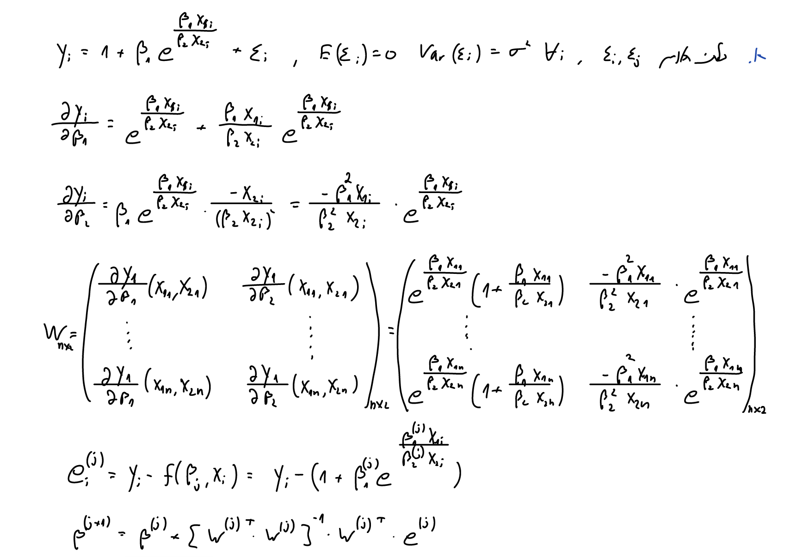

# Q1 #

## a ##


```{r}
#
```


```{r}
ex6data1 <- read.csv("C:/Users/Alon/Desktop/Studies/Statistics/Statistical_Computing/Exercises/HW6/ex6data1.csv")

graduent.func <- function(beta1,beta2,x1_vec,x2_vec){
  ### input: beta1,beta2. output: the derivative for beta0 and beta1
  beta1_derivative <- ( 1 + (beta1*x1_vec)/(beta2*x2_vec) ) * exp((beta1*x1_vec)/(beta2*x2_vec))
  beta2_derivative <- - ( (beta1*beta1*x1_vec)/(beta2*beta2*x2_vec) ) * exp((beta1*x1_vec)/(beta2*x2_vec))
  return(matrix(data = c(beta1_derivative,beta2_derivative),ncol = 2))
}

beta1.j <- beta2.j <- 1 # first guess
y_vec.Q1 <- ex6data1$y
x1_vec.Q1 <- ex6data1$x1
x2_vec.Q1 <- ex6data1$x2

eps_for_break <- 10^-7

while (TRUE) {
  errors.j <- y_vec.Q1 - 1 - beta1.j*exp((beta1.j*x1_vec.Q1)/(beta2.j*x2_vec.Q1))
  betas.j <- matrix(data = c(beta1.j,beta2.j),nrow = 2,ncol = 1)
  W.j <- graduent.func(beta1.j,beta2.j,x1_vec.Q1,x2_vec.Q1)
  betas.j_1 <- betas.j + ( solve(t(W.j)%*%W.j) %*% t(W.j) ) %*% errors.j
  beta1.j <- betas.j_1[1]
  beta2.j <- betas.j_1[2]
  if (max(abs(betas.j_1 - betas.j)) < eps_for_break) {break}
}


```
```{r,echo=FALSE}
cat(sprintf("beta1 (GN) = %s", round(beta1.j,3)),
    sprintf("beta2 (GN) = %s", round(beta2.j,3)),
    sep = "\n")

```

## b ##

```{r}
delta <- 10^-4

grad_s <- function(beta1,beta2,x1_vec,x2_vec,y_vec){
  d_s_d_beta1 <- - 2 * sum( ( y_vec - 1 - beta1*exp((beta1*x1_vec)/(beta2*x2_vec)) ) * exp((beta1*x1_vec)/(beta2*x2_vec)) * (1+(beta1*x1_vec)/(beta2*x2_vec)))
  
  d_s_d_beta2 <- 2 * sum( ( y_vec - 1 - beta1*exp((beta1*x1_vec)/(beta2*x2_vec)) ) * exp((beta1*x1_vec)/(beta2*x2_vec)) * (beta1*beta1*x1_vec)/(beta2*beta2*x2_vec))
  
    return(matrix(data = c(d_s_d_beta1,d_s_d_beta2),nrow = 1,ncol = 2))
}

hesian <- function(beta1,beta2,x1_vec,x2_vec,y_vec,delta){
  y_d2_beta1 <- grad_s(beta1+delta,beta2,x1_vec,x2_vec,y_vec) - grad_s(beta1-delta,beta2,x1_vec,x2_vec,y_vec)
  
  y_d2_beta1 <- y_d2_beta1[1] / (2*delta)
  
  y_d2_beta2 <- grad_s(beta1,beta2+delta,x1_vec,x2_vec,y_vec) - grad_s(beta1,beta2-delta,x1_vec,x2_vec,y_vec)
  
  y_d2_beta2 <- y_d2_beta2[2] / (2*delta)
  
  y_d_beta1_d_beta2 <- grad_s(beta1,beta2+delta,x1_vec,x2_vec,y_vec) - grad_s(beta1,beta2-delta,x1_vec,x2_vec,y_vec)
  
  y_d_beta1_d_beta2 <- y_d_beta1_d_beta2[1] / (2*delta)
  
  return(matrix(data = c(y_d2_beta1,y_d_beta1_d_beta2,y_d_beta1_d_beta2,y_d2_beta2),nrow = 2,ncol = 2))
  
  }

beta1_h.j <- beta2_h.j <- 1 # first guess
y_vec.Q1 <- ex6data1$y
x1_vec.Q1 <- ex6data1$x1
x2_vec.Q1 <- ex6data1$x2

counter <- 0

eps_for_break <- 10^-5

while (TRUE) {
  counter <- counter+1
  betas_h.j <- matrix(c(beta1_h.j,beta2_h.j),ncol = 1)
  betas_h.j_1 <- betas_h.j - solve(hesian(beta1_h.j,beta2_h.j,x1_vec.Q1,x2_vec.Q1,y_vec.Q1,delta)) %*% t(grad_s(beta1_h.j,beta2_h.j,x1_vec.Q1,x2_vec.Q1,y_vec.Q1))
  
  beta1_h.j <- betas_h.j_1[1]
  beta2_h.j <- betas_h.j_1[2]
  if (max(abs(betas_h.j_1 - betas_h.j)) < eps_for_break) {break}
}


```

```{r,echo=FALSE}
cat(sprintf("beta1 (NR) = %s", round(beta1_h.j,3)),
    sprintf("beta2 (NR) = %s", round(beta2_h.j,3)),
    sep = "\n")

```